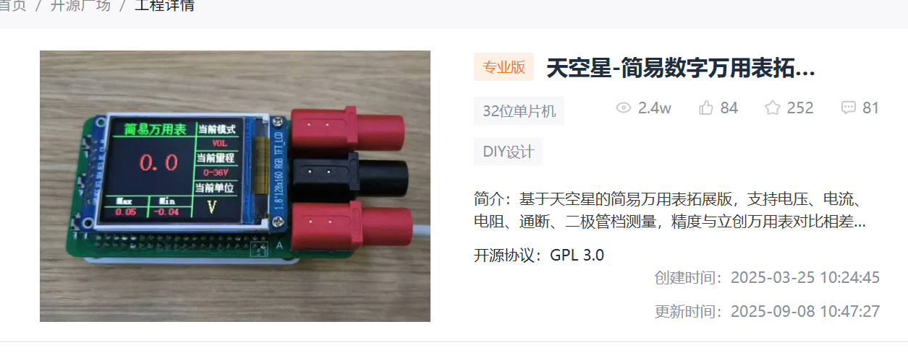
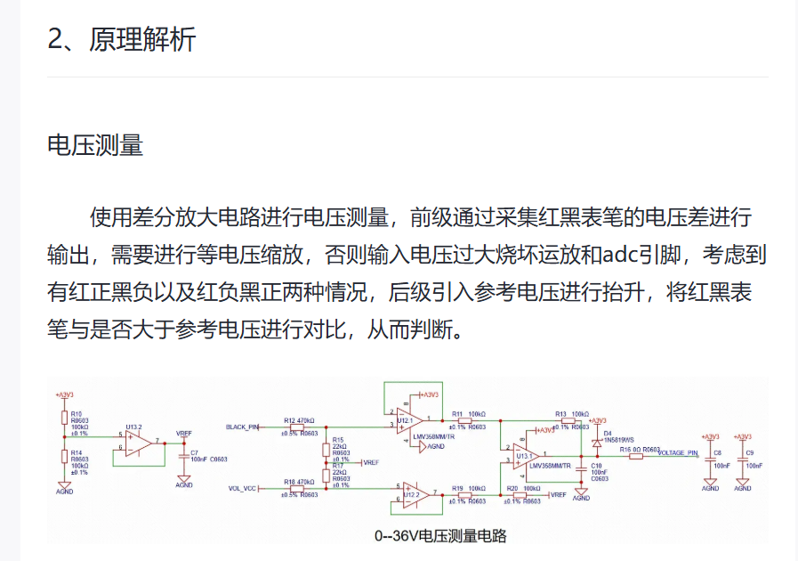
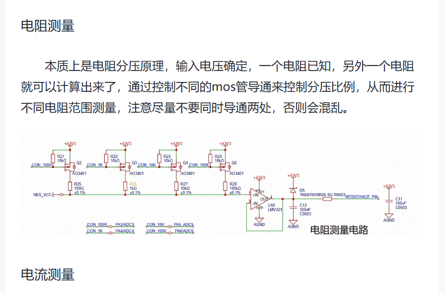
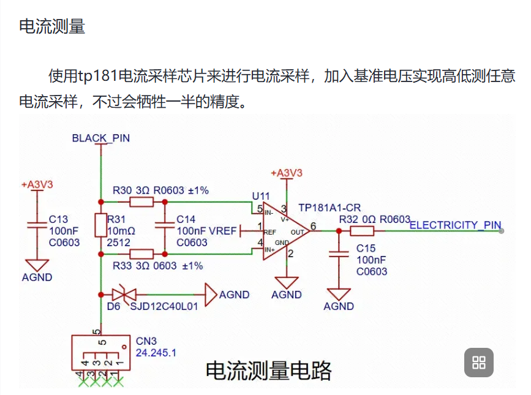
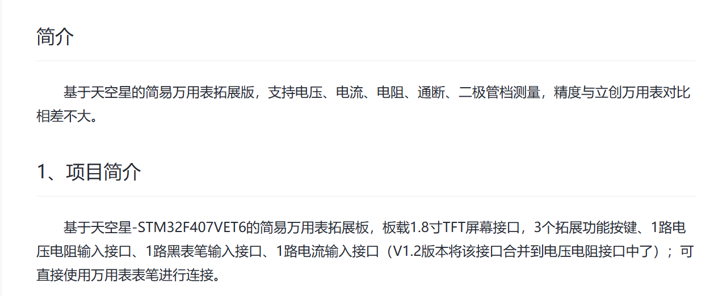

# 天空星简易数字万用表 · 再次复刻整理

本仓库是对已有开源工程的再次复刻与资料整理（“复刻的复刻”），用于学习、保存与交流。原始设计和代码归原作者及相应贡献者所有，本仓库不将原项目成果声明为原创。

开源来源：[立创开源硬件平台：天空星-简易数字万用表拓展板](https://oshwhub.com/course-examples/tian-kong-xing-jian-yi-shu-zi-wan-yong-biao-tuo-zhan-ban)。本文的硬件介绍、原理概述及 V1.2 改动说明依据该项目的截图和说明整理。

## 本次上传了什么

- 上传当前本地的两套固件：`stm32-multimeter/` 和 `stm32-multimeter-V2.0/`，保留原有目录名称。
- 包含业务源码、STM32 HAL/CMSIS 库、CubeMX 配置、Keil 工程及随工程附带的 HEX 固件。
- 保留原始 `说明文档.md` 与 `LICENSE`。当前上传以固件工程为主，不包含完整 PCB/原理图设计工程。
- 新增本中文 README，说明复刻关系、项目功能、测量原理、V1.2 改动及工程打开方式；附上用户提供的原项目截图。
- 排除 Keil 编译中间文件、构建日志与本机调试记录。本次未修改测量算法，也未重新编译、烧录或验证测量精度；现有 HEX 是原工程附带文件。

## 1、项目简介

项目基于天空星 STM32F407VET6，制作简易数字万用表拓展板，支持电压、电流、电阻、通断和二极管档测量。

原项目介绍包含 1.8 英寸 TFT 屏幕接口、3 个拓展功能按键、电压/电阻输入接口、黑表笔接口和独立电流输入接口，可连接万用表表笔。原项目 V1.2 将电流输入合并至电压/电阻接口，以两个表笔接口完成测量。

固件使用 STM32 HAL 库、168 MHz 系统时钟和裸机主循环。通过 ADC 采样、均值及排序滤波处理测量数据，通过 SPI 驱动 TFT；双击 KEY3 可依次切换测量模式。



## 2、原理解析

### 电压测量

采用差分放大电路采集红、黑表笔之间的电压差，通过分压缩小输入电压。为处理表笔正接和反接，引入参考电压偏置，软件根据采样值相对参考电压的位置判断极性，并换算输入电压。

下图来自原项目资料，展示的是旧版电路，其中器件型号和阻值不能直接作为 V1.2 的装配清单。



### 电阻测量

利用已知电阻与被测电阻分压，根据采样电压计算被测阻值。通过 MOS 管选择不同的分压电阻以覆盖不同量程，切换时应避免同时导通多个分压支路。



### 电流测量

使用 TP181 电流采样芯片检测采样电阻压降，引入参考电压偏置后进行换算。原项目说明指出，该方式会占用部分采样动态范围。V1.2 引入的固态继电器限制了电流通路，测量电流不能超过 2 A。



## 3、V1.2版本改动说明

以下为原项目 V1.2 更新说明的整理，感谢原作者及评论区贡献建议的参与者。这些内容是原项目版本记录，不代表本仓库此次上传新完成了这些硬件修改。

1. **更换运算放大器**：LMV358 更换为 TLV2333，LMV321 更换为 TLV333，以降低运放失调电压，成本也有所增加。
2. **调整运放阻容**：每个运放输出接口均加入 10 Ω 电阻和 2.2 nF 电容，用于抑制输出振荡，使采集更加稳定。
3. **调整电压采集分压电阻**：将电阻值等比例缩小，减少过大阻值带来的失调影响及可能的增益隆起。
4. **增加一路固态继电器**：用于电流通路切换，仅需两个接口即可完成原有功能。受该通路限制，电流测量最大不能超过 **2 A**。
5. **调整 PCB 布局和表头接口**：表头接口改为香蕉座，板框与原天空星板保持一致，整体更加小巧。
6. **更新配套代码**：由于继电器切换方式变化，需要调整固件。原作者说明配套代码已更新至 Gitee，Wiki 链接也已更新；具体入口请以原项目页面为准。
7. **补充焊接资料**：新版体积缩小，部分丝印无法保留，焊接难度增加。原作者提供焊接 PDF，建议按轮廓图焊接，尤其注意影响测量精度的 **0.1% 精度电阻**。本仓库当前未包含该 PDF，请从原项目获取。
8. **测量表现**：据原作者描述，新版测量结果与旧版基本一致，与立创万用表相比无明显偏差，但稳定性更好、抖动更小，测试图可参考旧版。这是原作者的测试描述，并非本次上传的实测结论。

> **版本名称说明**：V1.2 是用户提供的原项目硬件改动说明；本地源码目录名为 `stm32-multimeter` 和 `stm32-multimeter-V2.0`。两种编号不能仅凭名称直接对应。请根据实际硬件引脚和电路选择固件，原说明明确指出两个代码版本不能混用。

## 4、目录结构与 Keil 打开方式

```text
.
├── README.md
├── LICENSE
├── 说明文档.md
├── docs/images/                 # 原项目截图
├── stm32-multimeter/            # 原版固件工程
│   ├── BSP_Library/             # 测量、按键、显示及软件计时
│   ├── Core/                    # 主程序及外设初始化
│   ├── Drivers/                 # HAL/CMSIS
│   └── MDK-ARM/                 # Keil 工程及附带固件
└── stm32-multimeter-V2.0/       # 另一硬件版本对应固件
    ├── BSP_Library/
    ├── Core/
    ├── Drivers/
    └── MDK-ARM/
```

在 Keil 中选择 **Project → Open Project**，根据硬件版本打开：

- [原版 Keil 工程](stm32-multimeter/MDK-ARM/stm32-multimeter.uvprojx)
- [V2.0 Keil 工程](stm32-multimeter-V2.0/MDK-ARM/stm32-multimeter.uvprojx)

工程配置使用 ARM Compiler 5.06。`.ioc` 文件用于 CubeMX 配置，不是 Keil 工程入口。部分源码中文注释采用 GBK 编码。

测量相关代码集中于 `BSP_Library/bsp_task.c`；按键及测量通路切换位于 `BSP_Library/bsp_key.c`。参考电压、分压参数和零点补偿需要按实际硬件校准。

## 5、来源与许可说明

- 原项目来源：[天空星-简易数字万用表拓展板](https://oshwhub.com/course-examples/tian-kong-xing-jian-yi-shu-zi-wan-yong-biao-tuo-zhan-ban)。
- 用户提供的原项目页面截图标注 **GPL 3.0**，但当前代码包附带的 [LICENSE](LICENSE) 文本是 **GNU AGPL Version 3**。本仓库原样保留该许可文件，记录此差异，不自行将许可替换为 GPL；如需确认原作者的授权意图，请查阅原项目或联系原作者。
- HAL/CMSIS 等第三方组件保留各自的版权声明和许可文件。
- README 中引用的原项目图片及说明归原作者及相应权利人所有，用于标注来源和辅助复刻学习。

<details>
<summary>原项目简介截图</summary>



</details>
